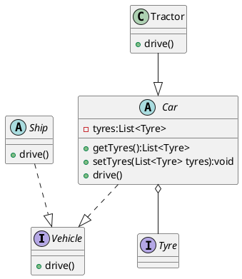

### UML简介
统一建模语言（Unified Modeling Language，UML）是用来设计软件蓝图的可视化建模语言

### UML特点
简单、统一、图 形化、能表达软件设计中的动态与静态信息

### UML应用场景
用例图、类图、对象图、状态图、活动图、时序图、协作图、构件图、部署图等 9 种图

### 类
使用包含类名、属性和 操作且带有分隔线的矩形来表示。
*  类名（Name）是一个字符串，例如，Student
*  属性（Attribute）是指类的特性，即类的成员变量
> 格式表示：[可见性]属性名:类型[=默认值] —— 例如：-name:String 
* 操作（Operations）是类的任意一个实例对象都可以使用的行为，是类的成员方法
> [可见性]名称(参数列表)[:返回类型] —— 例如：+display():void

“可见性”表示该属性对类外的元素是否可见，包括公有（Public）、私有（Private）、受保护 （Protected）和朋友（Friendly）4 种，在类图中分别用符号+、-、#、~表示。 

### 接口
使用一个带有名称的小圆圈来进行表示
* 其他类似

### 类图
类图（ClassDiagram）是用来显示系统中的类、接口以及它们之间协作的静态结构和关系的一种静态模型

### 类之间的关系

* 依赖 —— 使用关系，对象之间耦合度弱，是临时性的关联。在代码中，某个类的方法通过局部变量、方法的参数或者对静态方法的调用来访问另一个类（被依 赖类）中的某些方法来完成一些职责。
在 UML 类图中，依赖关系使用带箭头的虚线来表示，箭头从使用类指向被依赖的类。
* 关联 —— 引用关系
  * 一般 —— 关联可以是双向的，也可以是单向的。在 UML 类图中，双向的关联可以用带两个箭头或者没有箭头的 实线来表示，单向的关联用带一个箭头的实线来表示，箭头从使用类指向被关联的类。也可以在关联线 的两端标注角色名，代表两种不同的角色。
    在代码中通常将一个类的对象作为另一个类的成员变量来实现关联关系。

  * 聚合 —— 强关联关系，是整体和部分之间的关系，是 has-a 的关系。聚合关系也是通过成员对象来实现的，其中成员对象是整体对象的一部分，但是成员对象可以脱离整体对象而独立存在。在 UML 类图中，聚合关系可以用带空心菱形的实线来表示，菱形指向整体。 

  * 组合 —— 组合（Composition）关系也是关联关系的一种，也表示类之间的整体与部分的关系，但它是一种更强 烈的聚合关系，是 contains-a 关系。在组合关系中，整体对象可以控制部分对象的生命周期，一旦整体对象不存在，部分对象也将不存在，部分对象不能脱离整体对象而存在。在 UML 类图中，组合关系用带实心菱形的实线来表示，菱形指向整体。

* 泛化 —— 耦合度大的一种关系，表示一般与特殊的关系，是父类与 子类之间的关系，是一种继承关系，是 is-a 的关系。在 UML 类图中，泛化关系用带空心三角箭头的实线来表示，箭头从子类指向父类。

* 实现 —— 是接口与实现类之间的关系。在这种关系中，类实现了接口，类中的操作实 现了接口中所声明的所有的抽象操作。在 UML 类图中，实现关系使用带空心三角箭头的虚线来表示，箭头从实现类指向接口。

