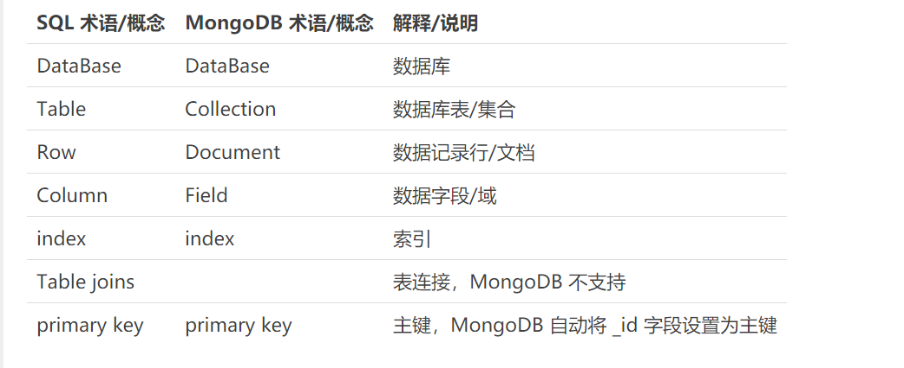

# mongoDB
### 是什么
* 一款基于`分布式文件存储`的NoSQL数据库
* C++编写
* 旨在为web应用提供`可扩展`、`高可用`的数据存储解决方案

介于关系型数据库与非关系型数据库之间，非关系型数据中功能最完善，最像关系型数据库的。

NoSQL分类
* 键值型（key-value）
* 文档型

特点
* 查询语言强大，类似SQL的单表查询
* 支持数据建立索引

概念术语

