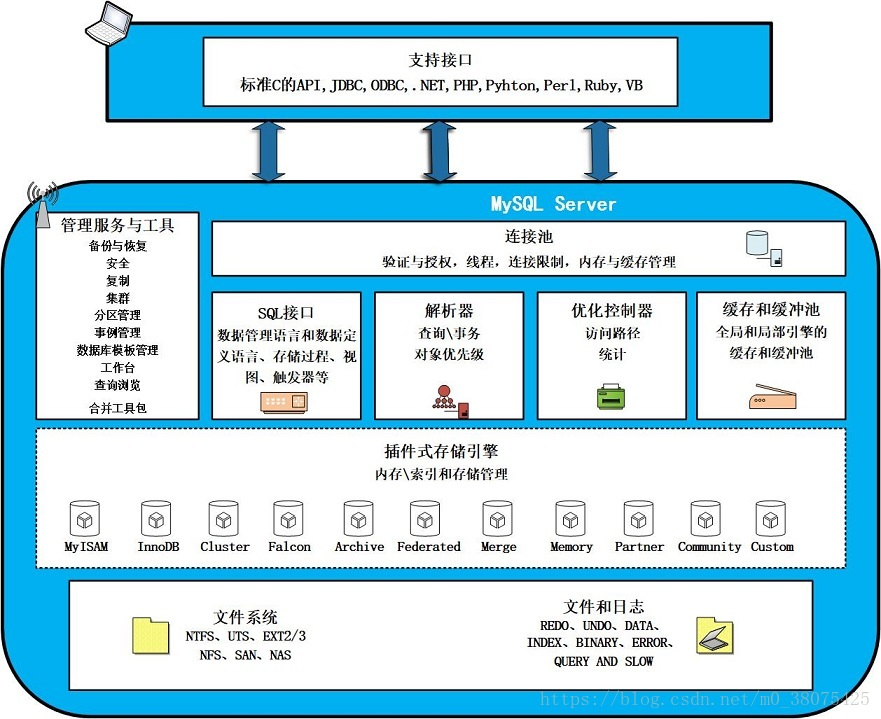
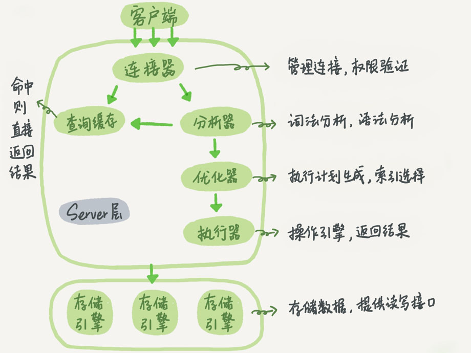
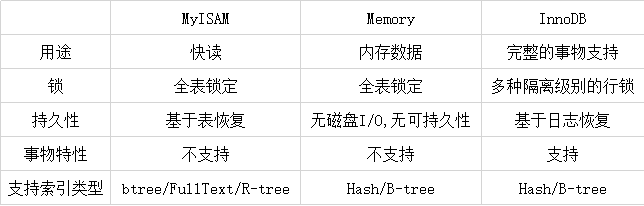
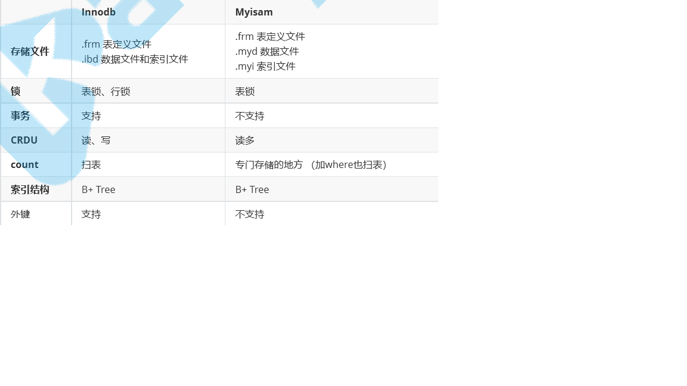

## 架构篇
### 逻辑架构
 
* 连接层
* 服务层
* 引擎层
* 存储层

### 脚本流程
#### 简化版

#### 复杂版

上图中，整个架构分为两层，上层是MySQLD的，被称为的‘SQL Layer'，下层是各种各样，对上提供接口的存储引擎，被称为‘Storage Engine Layer'。 
执行流程 
1.连接 
　　1.1客户端发起一条Query请求，监听客户端的‘连接管理模块'接收请求 
　　1.2将请求转发到‘连接进/线程模块' 
　　1.3调用‘用户模块'来进行授权检查 
　　1.4通过检查后，‘连接进/线程模块'从‘线程连接池'中取出空闲的被缓存的连接线程和客户端请求对接，如果失败则创建一个新的连接请求 
2.处理 
　　2.1先查询缓存，检查Query语句是否完全匹配，接着再检查是否具有权限，都成功则直接取数据返回 
　　2.2上一步有失败则转交给‘命令解析器'，经过词法分析，语法分析后生成解析树 
　　2.3接下来是预处理阶段，处理解析器无法解决的语义，检查权限等，生成新的解析树 
　　2.4再转交给对应的模块处理 
　　2.5如果是SELECT查询还会经由‘查询优化器'做大量的优化，生成执行计划 
　　2.6模块收到请求后，通过‘访问控制模块'检查所连接的用户是否有访问目标表和目标字段的权限 
　　2.7有则调用‘表管理模块'，先是查看table cache中是否存在，有则直接对应的表和获取锁，否则重新打开表文件 
　　2.8根据表的meta数据，获取表的存储引擎类型等信息，通过接口调用对应的存储引擎处理 
　　2.9上述过程中产生数据变化的时候，若打开日志功能，则会记录到相应二进制日志文件中 
3.结果 
　　3.1Query请求完成后，将结果集返回给‘连接进/线程模块' 
　　3.2返回的也可以是相应的状态标识，如成功或失败等 
　　3.3‘连接进/线程模块'进行后续的清理工作，并继续等待请求或断开与客户端的连接 

整理自[SQL语句执行深入讲解](http://www.uxys.com/html/MySQL/20200203/69945.html)

### 引擎
#### 常见

##### InnoDB和MyISAM的区别

#### 选型推荐
* InnoDB
  * 事务完整性
  * 并发控制
  * 频繁读写
* MyISAM
  * 强调高效插入、读取记录，事务完整性、并发度不高
* MEMORY
  * 读写速度快，事务完整性、并发度不高，易丢失数据，表不能太大
  
不同引擎的表在设计的尽量不要有关联，表关联查询的时候可能会因为不同的引擎出现错误，其次，一旦设计好之后后期不要轻易去改变表引擎。  
  
### 物理存储
mysql通过文件系统对数据和索引进行存储
* 日志        顺序IO
* 数据索引      随机IO

#### 日志文件
> 查看日志开启情况 
  show variables like 'log_%';
* error log 
    记录了mysql运行期间遇到的所有严重错误，以及每次启动、关闭的详细信息 
* bin log 
    记录了数据变化，包含所有的DDL和DML语句，但不包括select语句。以事件形式记录了数据的变更顺利，以及每个更新语句的执行时间。 
    DDL直接录入bin log，DML则必须通过事务提交才能记录到bin log。
* general query log 
    什么都记录，耗性能，生产中不开启
* slow query log 
    定位慢SQL，是SQL性能调优的基础依据 
    默认关闭，开启方式： 
    > slow_query_log=ON 
      long_query_time=3 
      #日志记录文件如果没有给出file_name值， 默认为主机名，后缀为-slow.log。 
      #如果给出了文件名， 但不是绝对路径名，文件则写入数据目录。 
      slow_query_log_file=file_name

* redo log
    恢复使用
* undo log
    回滚使用
* relay log
    主从复制使用
    
#### 数据文件
> 查看数据文件
  show variables like 'datadir%';
  
* InnoDB 
    .frm存储表信息元数据 
    .ibd使用独享表空间存储表的数据与索引 
    .ibdata使用共享表空间存储表的数据与索引 

* MyISAM 
    .frm存储表信息元数据 
    .myd存储表记录 
    .myi存储索引树 
    
    