# 索引提升篇
## 需要创建索引的情况
* 主键字段（自动创建）
* 频繁作为查询条件的字段（where）
* 多表查询的关联字段（on的两边）
* 查询中排序的字段（B+ tree）
* 覆盖索引
* 统计或分组字段

## 不需要创建索引的情况
* 表记录太少
* 频繁更新
* 查询字段使用频率不高

一个组合索引会创建几个索引树？
主键索引为什么推荐使用数值？

## 组合索引
###好处
* 建一个索引树，相当于创建了多个索引树
* 优化排序
* 使用覆盖索引

### 最左前缀匹配原则
组合索引按照创建时的元素列顺序，从左到右挨个匹配。 
能匹配上就使用组合索引，如果出现中断，那么在索引时后续列就使用不到了。 
如果使用了[>, <, BETWEEN, LIKE]中的一个，后续列也不会用于索引。 

## 索引失效
不管一张表有几个索引，查询时最多使用一个，index-merge除外。
### explain表
* id 
    > 查询唯一标识符（系统自动分配) 
    id越大优先级越高 
    id相同执行自上而下 
    id为null，则为结果集
* **select_type**
    > 查询类型
* table
    > 查询对应表 
    有别名，显示别名 
    没有操作表，则显示null 
    尖括号表示临时表，结果来自其他id查询结果集 
* partitions
    > 分区    
* **type**
    > 关联类型
* possible_keys
    > 可供选用的索引
* key
    > 最终选用的索引
* key_len
    > 最终选用索引使用了的字段长度 
    key_len只计算了where条件中用到的索引长度，排序和分组方面的不在计算范围内
* ref
    > 引用类型，与key配合使用 
    等值常数，显示const 
    连接查询，显示关联字段 
    使用了表达式、函数或内部隐式转换，显示func
* rows
    > 查询估计扫描多少行 
    估计是因为innodb使用了mvcc
* filtered
    > 查询过滤数据出所占的百分比    
* **Extra**
    > 额外的信息
    
### select_type
* simple
    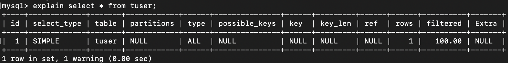
* primary
    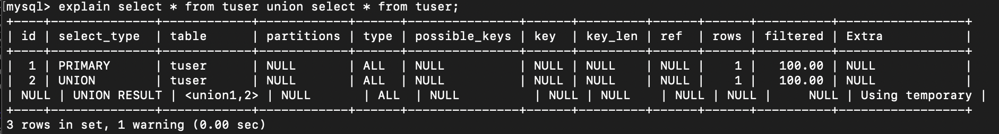
* union
    
* subquery
    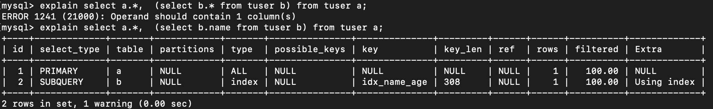
* dependent union
    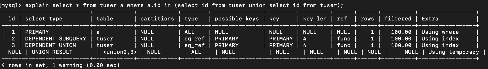
* dependent subquery
    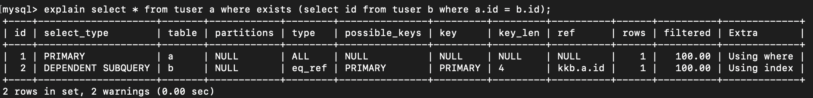
    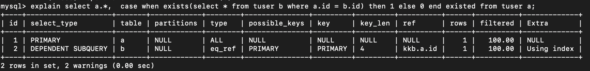
* derived
    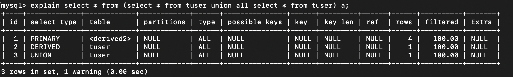
* union result
    

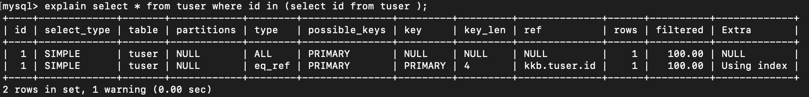
### type
以下关联类型，性能依次由好到差：
* system
    > 表中只有一条记录或空表
* **const**
    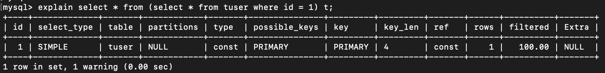
* **eq_ref**
    > 多表关联、等值连接、唯一索引
    
    
    
* **ref**
    > 多表关联、等值连接、非唯一（含组合）索引
* fulltext
    > 优先级高于普通索引
* ref_or_null
    > 与ref类似，增加了null值比较
* unique_subquery
    > where in子查询返回唯一值
* index_subquery
    > where in子查询返回值可能不唯一，可使用索引去重
* **range**
    > 索引范围查询，常见与>, <, is null, between, in, like等运算符的查询中

    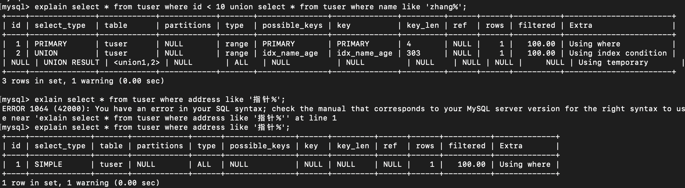
* index_merge
    > 查询使用了两个以上的索引，取交集或并集，常见于and, or使用了不同的索引。
* **index**
    > 结果列中只使用了索引字段
    
    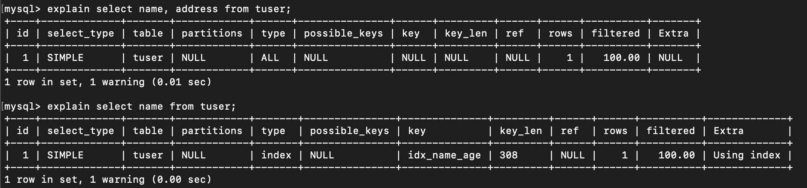
* ALL
    > 全表扫描，在server层进行记录过滤
    
    
    注意：
    - 除了all之外，其他的type都可以使用到索引
    - 除了index_merge之外，其他的type只可以用到一个索引 
    - 最少要使用到range级别    
### Extra
显示一些其他的不适合显示，却很重要的信息
* **using filesort**
    > 文件排序(也可能是内存排序)，无法借助索引完成排序，常见于order by或group by语句
    
    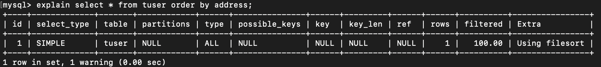
* **using index**
    > 查询不回表 
    表明使用了覆盖索引 
    如果同时出现了using where，表明索引被用于where查询； 
    如果没有出现，则表明索引仅用于数据查询
    
    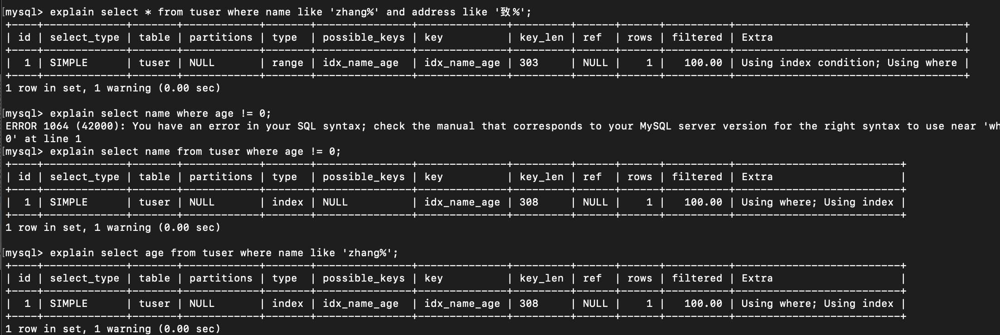
    
* **using index condition**
    > 使用索引条件下推（ICP）技术过滤数据 
    index key 
    index filter 
    table filter 
    > 
    > ICP使用条件： 
    使用二级索引 
    不走覆盖索引 
    
* using temporary
    > 表示使用临时表存储结果
    order by和group by也会使用临时表
    
    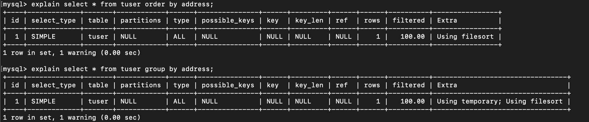
    
* distinct
    > 查询中使用了distinct关键字
    
* **using where**
    > 数据需要在server层进行过滤
    
    
### 总结口诀    
    全值匹配我最爱，最左前缀要遵守；
    带头大哥不能死，中间兄弟不能断；
    索引列上少计算，范围之后全失效；
    Like百分写在右，覆盖索引不写*；
    不等空值还有or，索引失效要少用。
    
* 解决like ‘%字符串%’时，索引失效问题的方法? 
使用覆盖索引可以解决。