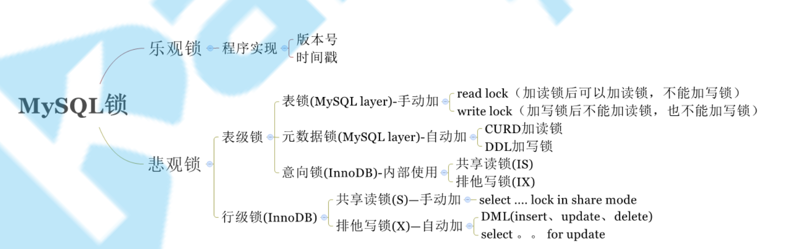
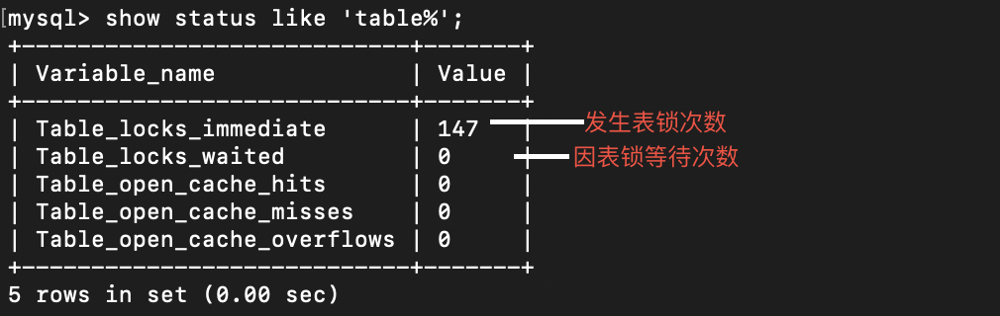

# 锁篇
## 总览

## 表级锁
### 表锁
查看表级锁争用状态

表锁表现形式
* 共享读锁
* 排他写锁

#### 操作
    手动加表锁
    lock table 表名称 read(write),表名称2 read(write)，其他;
    
    查看表锁情况
    show open tables;

    移除表锁
    unlock tables;
 

#### 演示 //todo

### 元数据锁
    MDL不需要显式添加，访问表时会自动添加。
    MDL的作用：保证读写正确性。
    CRUD操作加读锁，DDL加写锁。

#### 演示 //todo

### 行锁
    通过给索引上的索引项加锁实现，这也意味着：
    只有通过索引条件检索的数据，InnoDB才使用行锁；
    否则，使用表锁
    
#### 行读锁

#### 行读锁升级表锁

#### 行写锁

#### 间隙锁

#### 死锁
