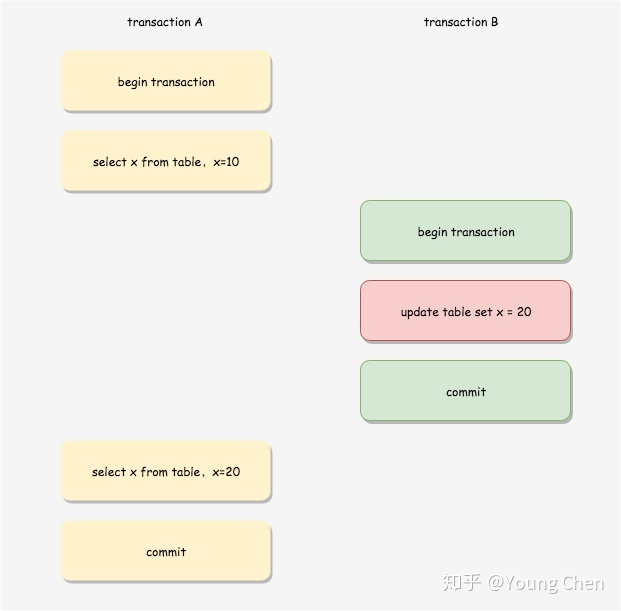
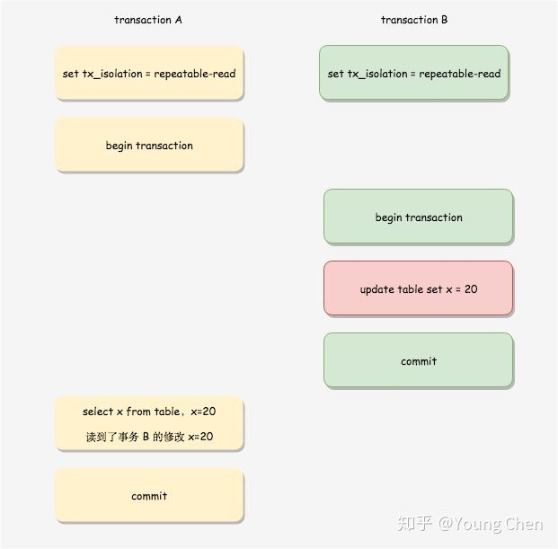

### MVCC(多版本并发控制)
#### 是什么
  现代数据库引擎实现中常用的`处理读写冲突的手段`
#### 为什么
  提高数据库在并发场景下的吞吐性能
#### 怎么做(MYSQL)
* 数据结构
>版本链 + ReadView

* 实现原理
  * 版本链
  >一条记录的数据结构
  DATA_TRX_ID 事务id，记录了当前记录的事务版本
  DATA_ROLL_PTR 回滚指针，记录了上一版本记录的位置
  DB_ROW_ID 当前记录的唯一键(主键 > 其他唯一键 > 默认生成唯一键)
  DELETE_FLAG 当前记录是否已删除 
  
  >记录分类：当前版本、历史版本、最新版本 
  
  >事务的操作版本链的流程(假定更新单条记录)： 
  1、当前最新版本记录加排他锁 
  2、将最新版本记录的值拷贝到`undo log`中 
  3、将修改的值设置到当前最新版本记录中，同时更新事务id，将回滚指针指向拷贝记录 
  4、记录`redo log`，包含`undo log`中的修改...去锁 
  像这样，每条记录就各自形成了一个完整的版本链
  * ReadView
  >相关定义 
  trx_id 事务id 
  m_ids 当前活跃事务id列表 
  up_limit_id 最小活跃事务id 
  low_limit_id 最大活跃事务id
  
  >生成时机 
  RR：事务第一次读 
  RC：事务每次读
  
  >策略 
  1、如果当前记录的事务id小于最小活跃事务id，则直接可见 
  2、如果当前记录的事务id大于最大活跃事务id，则不直接可见，需要回溯版本链重新决定可见版本 
  3、如果当前记录的事务id介于最大和最小之间:
  > * 如果在当前活跃事务id列表中，则不直接，需要回溯版本链确定
  > * 如果不在当前活跃事务id列表中，则直接可见 
  >
  > 4、最终确定的版本记录，再根据DELETE_FLAG是否返回透出
  
* 作用域
> RC/RR
  
* 策略失效
> 并非所有的情况都能套用MVCC读的判断策略，特别是在一个事务进行期间，另一个事务提交了修改的情况。
> 不论是RC，还是RR，版本记录是否可见的本质，就在于ReadView生成时，事务是否已提交。 
> RC下：
> 
>
> RR下：
> 
  

